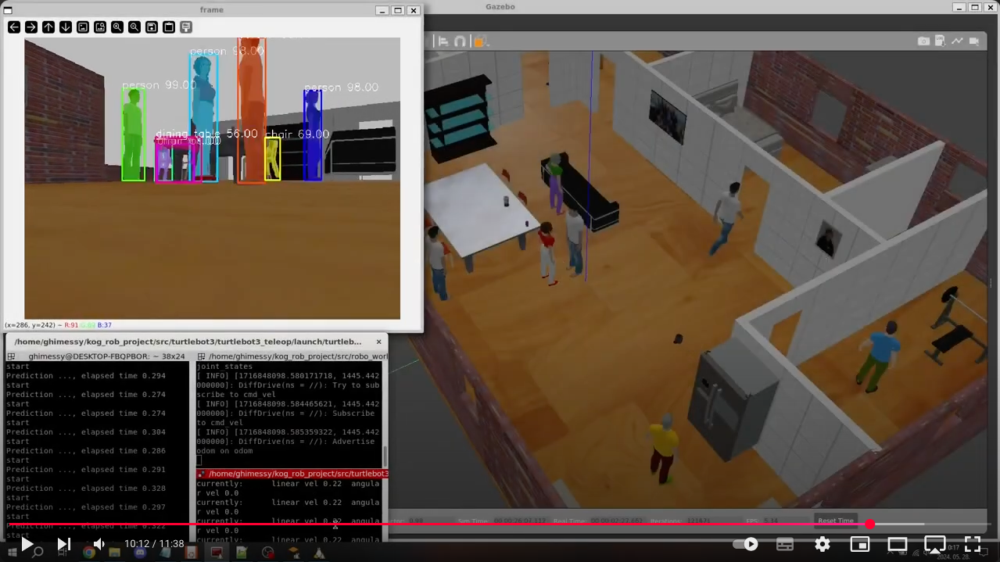
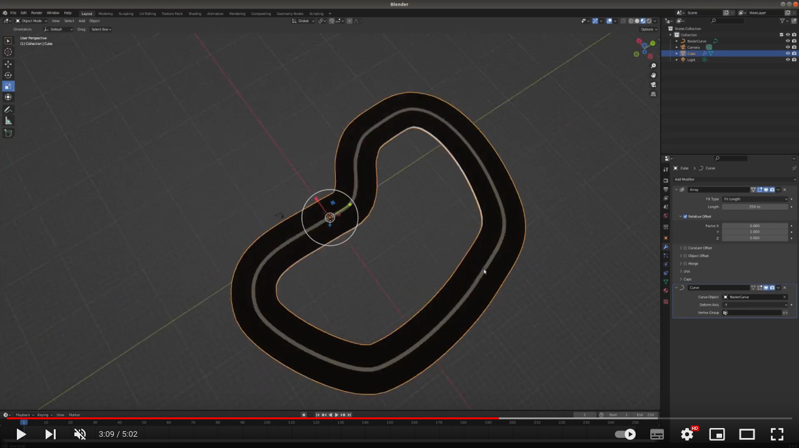
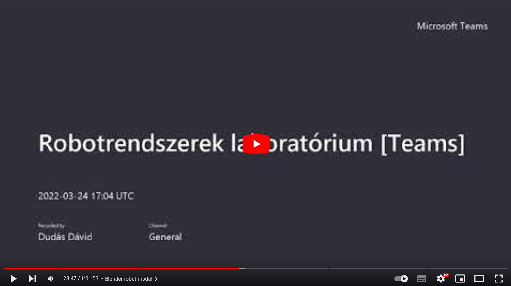

[//]: # (Image References)

[image1]: ./assets/new_node.png "new node"
[image2]: ./assets/rqt.png "rqt"
[image3]: ./assets/turtlesim.png "turtlesim"
[image4]: ./assets/turtlesim_topics.png "turtlesim"
[image5]: ./assets/gazebo.png "gazebo"
[image6]: ./assets/gazebo_2.png "gazebo"
[image7]: ./assets/gazebo_3.png "gazebo"
[image8]: ./assets/rviz_1.png "rviz"
[image9]: ./assets/real_robot_1.png "real robot"
[image10]: ./assets/real_robot_2.png "real robot"
[image11]: ./assets/camera_1.png "camera"
[image12]: ./assets/camera_2.png "camera"
[image13]: ./assets/dark_line.png "Line"
[image14]: ./assets/dark_line_2.png "Line"
[image15]: ./assets/opencv_1.png "OpenCV"
[image16]: ./assets/opencv_2.png "OpenCV"
[image17]: ./assets/opencv_3.png "OpenCV"
[image18]: ./assets/opencv_4.png "OpenCV"
[image19]: ./assets/save_images_1.png "Save image"
[image20]: ./assets/save_images_2.png "Save image"
[image21]: ./assets/save_images_3.png "Save image"
[image22]: ./assets/cnn_1.png "CNN"
[image23]: ./assets/cnn_2.png "CNN"
[image24]: ./assets/cnn_3.png "CNN"
[image25]: ./assets/red_1.png "Red line"
[image26]: ./assets/red_2.png "Red line"

# Kognitív robotika

## Korábbi Házi feladatok - Robotrendszerek

<a href="https://www.youtube.com/watch?v=uLRQJh-y9AU"></a>

## Tartalomjegyzék
1. [ROS alapok](#ROS-alapok)  
2. [Gazebo alapok](#Gazebo-alapok)  
3. [Teszt a valódi roboton](#Teszt-a-valódi-roboton)
4. [Turtlebot MOGI](#Turtlebot-MOGI)  
5. [Vonalkövetés](#Vonalkövetés)
6. [Hagyományos képfeldolgozás](#Hagyományos-képfeldolgozás)
7. [Neurális háló](#Neurális-háló)
8. [Képfeldolgozás a valódi roboton](#Képfeldolgozás-a-valódi-roboton)

# ROS alapok
A Kognitív robotika (BMEGEMINMKR) labor anyaga jelentős részben támaszkodik a [Robotrendszerek (BMEGEMINMRL) tárgy anyagára](https://github.com/MOGI-ROS/Week-1-2-Introduction-to-ROS#mi-is-az-a-ros). Az itt található tananyag sokszor rövidített/egyszerűsített kivonata a Robotrendszerek tárgy anyagának, de ettől függetlenül, önálló tananyag és nem szükséges hozzá a Robotrendszerek tárgy ismerete. 

## Mi a ROS?
A ROS = Robot Operating System, de valójában ez nem egy operációs rendszer, hanem egy olyan middleware, melyet a robotikában széles körben alkalmaznak. Nyíltforráskódú és könyvtárai segítségével lehetővé teszi a robot alkalmazások gyors fejlesztését. Sok előre beépített funkciót tartalmaz, amiket meg fogunk ismerni a félév során, például kamerák és más szenzorok kezelése, térképezés és útvonaltervezés, telemanipuláció, stb. Fejlesztését 2007-ben kezdte a Stanford egyetem, 2008-ban csatlakozott a fejlesztéshez a Willow Garage és 2013 óta az OSRF gondozásában, ami 2017-ben Open Robotics-ra változtatta a nevét. 2018 óta a Microsoft és az Amazon részt vesz a ROS fejlesztésében.

Ugyan a Microsoft 2018 óta érdeklődik a ROS iránt, és most már telepíthető Windows-ra is, továbbra is a Linux operációs rendszer a legelterjedtebb, ezt fogjuk használni mi is a WSL (Windows Subsystem Linux) segítségével. Bár egyre több programnyelv támogatott a C++ és Python programozási nyelvek a legelterjedtebbek ROS esetén, mi is ezeket fogjuk használni. A ROS-hoz készített alkalmazásokat/komponenseket node-oknak nevezzük, melyek közötti kommunikációt a ROS valósítja meg, mivel a kommunikáció TCP/IP alapú könnyen fejleszthetünk több, hálózatba kötött számítógépen elosztott alkalmazásokat. A robotot vezérlő ROS alkalmazás tehát sok, egymással kommunikáló node-ból épül fel, ezek a `publisher`-ek és a `subscriber`-ek. A ROS `service`-ekkel és `action`-ökkel ebben a tárgyban nem foglalkozunk részletesen.

## ROS telepítése, indítása
A tárgy során Ubuntu 20.04-et és [ROS Noetic](http://wiki.ros.org/noetic/Installation)-et fogunk használni akárcsak a Robotrendszerek tárgy során. A tárgy és a házifeladat projekt teljesítéséhez érdemes tehát egy Ubuntu 20.04-et futtató számítógép használata. Ha esetleg nem Ubuntu 20.04-et használnánk a mindennapokban, akkor is számos lehetőség van a használatára, a teljesség igénye nélkül felsorolok pár ötletet:
- Egy USB-s SSD-re vagy pendrive-ra telepítve, majd arról bootolva
- Windows 11 esetén a WSL2 Linux subsystemet használva
- Virtuális gépet használva

Telepítés során a `full desktop` csomagot ajánlott telepíteni, ebben a legtöbb dolog alapból benne van, amit használni fogunk.
```bash
sudo apt install ros-noetic-desktop-full
```

>A ROS Noetic 2025-ig támogatott.

A ROS telepítése után minden terminálban be kell tölteni a ROS környezetét, ha használni akarjuk, ezt a következő paranccsal tudjuk megtenni:
```bash
source /opt/ros/noetic/setup.bash
```
Ezután ki is tudjuk próbálni a ROS Master elindításával. A ROS Master felel az egyes node-ok regisztrációjáért, összeköti a publishereket és a subscriberek, ez írja le a teljes rendszerünk gráfját. Emellett ez tárolja a paramétereket is a `parameter server`-en. Miután a ROS Master összekötötte az egyes node-okat, a node-ok peer-to-peer kommunikálnak, nem a ROS Masteren keresztül, ezzel csökkentve a kommuniációs overheadet. További részletek a [ROS wiki](http://wiki.ros.org/Master)n.

A ROS Mastert a `roscore` paranccsal indítjuk el.

Ha a következő hibát kapjuk, akkor nem source-oltuk a ROS-t az adott terminálban a fenti paranccsal.
```bash
david@DavidsLenovoX1:~/catkin_ws$ roscore
Command 'roscore' not found, but can be installed with:

sudo apt install python3-roslaunch
```

Ha minden rendben van, akkor a követlezőt kell lássuk a terminál ablakunkban:
```console
david@david-precision-7520:~/bme_catkin_ws$ roscore
... logging to /home/david/.ros/log/7539c3ba-86a3-11ed-8b98-dd714a583910/roslaunch-david-precision-7520-84787.log
Checking log directory for disk usage. This may take a while.
Press Ctrl-C to interrupt
Done checking log file disk usage. Usage is <1GB.

started roslaunch server http://192.168.1.221:41289/
ros_comm version 1.15.15


SUMMARY
========

PARAMETERS
 * /rosdistro: noetic
 * /rosversion: 1.15.15

NODES

auto-starting new master
process[master]: started with pid [84802]
ROS_MASTER_URI=http://192.168.1.221:11311/

setting /run_id to 7539c3ba-86a3-11ed-8b98-dd714a583910
process[rosout-1]: started with pid [84819]
started core service [/rosout]
```

## Catkin workspace

A ROS használata során 3 különböző típusú szoftver csomagot érdemes megkülönböztetnünk:
1. A ROS által alapértelmezetten telepített csomagok, ezekhez bármikor hozzáférünk a `source /opt/ros/noetic/setup.bash` parancs után az adott terminálban.
2. Az `apt` csomagkezelővel, tárolóból feltett csomagok. Bár nem a ROS telepítéssel érkeztek, telepítés után ugyanúgy az alap rendszer részét képezik, mint az 1. kategória.
3. A saját csomagjaink, vagy mások pl. GitHub-ról letöltött csomagjai, amiket magunknak kell lefordítani. Ezeket mindig egy workspace-ben tároljuk, itt fejlesztjük és fordítjuk őket, csak akkor hozzáférhetők, ha a workspace-t is source-oljuk. Természetesen lehet több workspace-ünk is, és ezek között könnyen válthatunk a `source` bash paranccsal. A workspace-t `catkin workspace`-nek nevezzük a ROS fordítója, a catkin után.

A catkin workspace-t a következő paranccsal tudjuk (újra)fordítani:
```bash
catkin_make
```

Először tehát hozzuk létre a workspace-ünket és fordítsuk le üresen!
```bash
cd ~
mkdir -p catkin_ws/src
cd catkin_ws
catkin_make
```

Ezután létrejönnek a szükséges mappák és fájlok, hogy a workspace-ünket is tudjuk source-olni:
```bash
source ~/catkin_ws/devel/setup.bash
```

## .bashrc

A tárgy során - és általánosságban a ROS használata során - sok terminált fogunk használni, és nem praktikus ezeket a source parancsokat minden alkalommal leírni, ezért használhatjuk a Linux és bash egy nagyszerű funkcióját, a `.bashrc`-t. Ez egy olyan fájl, ami minden terminál indjtásakor automatikusan végrehajtódik, tehát nem kell többé maunálisan futtatgatnunk ezeket a parancsokat.

A `.bashrc` mindig a user home mappájában található, a home mappába bármikot visszatérhetünk a `cd ~` paranccsal. A .bashrc-t pedig megnyithatjuk a kedven szövegszerkesztőnkkel, esetemben például a `nano`-val:
```bash
david@david-precision-7520:~$ cd ~
david@david-precision-7520:~$ nano .bashrc
```

A `.bashrc`-be egyszerűen tegyük bele a source parancsokat, én például gyakran váltok workspace-ek között a következő módszerrel:
```bash
# ROS workspaces
source /opt/ros/noetic/setup.bash
#WORKSPACE=~/catkin_ws/devel/setup.bash
WORKSPACE=~/bme_catkin_ws/devel/setup.bash
source $WORKSPACE
```

A `.bashrc`-t mindenki a saját kedvére szabhatja, itt egy példa arról, ahogy én használom:

>[https://gist.github.com/dudasdavid/06ba536d7b45a658c70ecb39c2465d04](https://gist.github.com/dudasdavid/06ba536d7b45a658c70ecb39c2465d04)

## publisher node
Az egyszerűség kedvéért a tárgy során csak publisherekkel és subscriberekkel fogunk foglalkozni, és ezekkel is csak Pythonban, ha valaki szeretne megismerkedni a ROS service-ekkel is, illetve a fenti funkciókkal C++-ban, annak ajánlom a Robotrendszerek tárgy anyagát.

Kezdésképpen hozzuk létre az első saját csomagunkat a catkin workspace-ünk `src` mappájában a `catkin_create_pkg` parancs segítségével:
```bash
cd ~/catkin_ws/src
catkin_create_pkg kogrob_tutorial rospy
```

Futtassuk le a catkin_make parancsot a workspace-ünkben, és utána már használhatjuk a roscd parancsot, hogy azonnal a csomagunk mappájába léphessünk:
```bash
roscd kogrob_tutorial
```
A Python scripteket érdemes a csomagunkon belül egy `scripts` mappában tárolni, hozzuk tehát létre a mappát és az első Python ROS node-unkat `publisher.py` néven. Végül tegyük futtathatóvá!
```bash
mkdir scripts
cd scripts/
touch publisher.py
chmod +x publisher.py 
```
![alt text][image1] 

Nyissuk meg a `publisher.py` fájlt a kedvenc szövegszerkesztőnkkel, én a VS Code-ot fogom használni a tárgy során, de a Visual Studio, a PyCharm vagy bármi egyéb is egyformán jó megoldás!

A `publisher.py` kódja:
```python
#!/usr/bin/env python3

import rospy
from std_msgs.msg import Int32  # Message type used in the node

rospy.init_node('publisher')    # Init the node with name "publisher"

pub = rospy.Publisher('publisher_topic', Int32, queue_size=10)

rospy.loginfo("Publisher Python node has started and publishing data on publisher_topic")

rate = rospy.Rate(1)            # 1Hz

count = Int32()                 # Count is now a ROS Int32 type variable that is ready to be published

count.data = 0                  # Initializing count

while not rospy.is_shutdown():  # Run the node until Ctrl-C is pressed

    pub.publish(count)          # Publishing data on topic "publisher_topic"
    
    count.data += 1
        
    rate.sleep()                # The loop runs at 1Hz
```

Ha elindítjuk, akkor a következőt kell látnunk:

>_Ne felejtsünk roscore-t indítani egy másik terminálban!_
>```console
>david@david-precision-7520:~$ rosrun kogrob_tutorial publisher.py 
>Unable to register with master node [http://192.168.1.221:11311]: master may not be running yet. Will keep trying.
>```

```console
david@david-precision-7520:~$ rosrun kogrob_tutorial publisher.py 
[INFO] [1672313359.529865]: Publisher Python node has started and publishing data on publisher_topic
```
De hogyan láthatjuk az adatot, amit a `publsiher.py` küld?
1. A `rostopic echo` paranccsal közvetlenül a terminálban:
```console
david@david-precision-7520:~$ rostopic echo /publisher_topic
data: 35
---
data: 36
---
data: 37
```
2. Az `rqt` topic monitorával:
![alt text][image2] 

3. Saját ROS node-dal...

## subscriber node

Készítsük el a saját subscriber-ünket, először hozzuk létre - és tegyük futtathatóvá - a fájlt az előző mintájára:
```bash
roscd kogrob_tutorial
cd scripts/
touch subscriber.py
chmod +x subscriber.py
```

A `subscriber.py` kódja:
```python
#!/usr/bin/env python3

import rospy
from std_msgs.msg import Int32 # Message type used in the node

'''
"sub_callback" is the callback method of the subscriber. Argument "msg" contains the received data.
'''
def sub_callback(msg):
    rospy.loginfo("Received data from publisher_topic: %d", msg.data)

rospy.init_node('subscriber') # Init the node with name "subscriber_py"

rospy.Subscriber("publisher_topic", Int32, sub_callback, queue_size=10) 

rospy.loginfo("Subscriber_py node has started and subscribed to publisher_topic")

'''
rospy.spin() simply keeps your node from exiting until the node has been shutdown.
Unlike roscpp::spin(), rospy.spin() does not affect the subscriber callback functions,
as those have their own threads.
'''
rospy.spin() 
```

És próbáljuk is ki!
```console
david@david-precision-7520:~$ rosrun kogrob_tutorial subscriber.py 
[INFO] [1672313947.858942]: Subscriber_py node has started and subscribed to publisher_topic
[INFO] [1672313948.526696]: Received data from publisher_topic: 542
[INFO] [1672313949.526614]: Received data from publisher_topic: 543
[INFO] [1672313950.526684]: Received data from publisher_topic: 544
[INFO] [1672313951.526633]: Received data from publisher_topic: 545
[INFO] [1672313952.526628]: Received data from publisher_topic: 546
```

Ez azt jelenti, hogy ettől a ponttól képesek vagyunk megbízhatóan adatot küldeni és fogadni a ROS rendszerén belül. A ROS absztrakciójának köszönhetően ez történhet egy számítógépen, vagy akár a hálózaton elosztva különböző gépek között. Kis túlzással ilyen egyszerű a robot kerekeinek a sebességét, egy lidar vagy egy kamera képét is továbbítani.

## turtlesim és hasznos ROS eszközök

Végezetül, tegyünk egy lépést a szimuláció és a robotok irányába a `turtlesim` segítségével.
Indítsuk el a turtlesim node-ot, ami egy egyszerű kis 2D-s teknőcös-rajzolós világ:
```console
rosrun turtlesim turtlesim_node
```
![alt text][image3] 

És egy új terminálban indítsuk el a `turtle_teleop_key`-t is, amivel a billentyűzet nyilai segítségével tudjuk irányítani a teknőst:
```console
rosrun turtlesim turtle_teleop_key
```
Ha megnyitjuk az `rqt`-t akkor két érdekes topic-ot is látunk a topic monitorban:
![alt text][image4]

Figyeljük meg a `/turtle1/cmd_vel`-t miközben irányítjuk a teknőst, vagy indítsuk el a következő node-ot:
```console
david@david-precision-7520:~$ rosrun turtlesim draw_square 
```

Próbáljuk ki a teknős mozgatását egy saját node-dal:
```python
#!/usr/bin/env python3

import rospy
from geometry_msgs.msg import Twist      # We'll use Twist message in the node

rospy.init_node('turtlesim_draw_circle') # Init the node with name "turtlesim_draw_circle"

pub = rospy.Publisher('/turtle1/cmd_vel', Twist, queue_size=1)

rospy.loginfo("Turtlesim draw circle node has started!")

rate = rospy.Rate(20) # 20Hz

msg = Twist()
msg.linear.x  = 1
msg.angular.z = 1

while not rospy.is_shutdown(): # Run the node until Ctrl-C is pressed

    pub.publish(msg)           # Publishing twist message on topic "/turtle1/cmd_vel"
    #msg.linear.x += 0.005     # Uncomment this line to draw a spiral instead of circle
    rate.sleep()               # The loop runs at 20Hz
```

# Gazebo alapok

A Gazebo egy önálló fizikai szimulációs környezet, nem a ROS része, azonban rengeteg csomag segíti az integrációját a ROS-hoz. Jelenleg a 11-es verziónál tart, ez az utolsó Gazebo Classic kiadás, ami 2025-ig támogatott.

Ha a `ros-noetic-desktop-full` csomagot telepítettétek, akkor a Gazebo már telepítve van.

Ha valamiért még sincs telepítve akkor a `sudo apt install gazebo11` paranccsal tudjátok telepíteni.

A hivatalos Gazebo tutorialokat [ezen a linken](http://gazebosim.org/tutorials) éritek el.

## Gazebo indítása, modellek
A Gazebo-t a `gazebo` paranccsal tudjuk elindítani, és indulás után a következő képernyő fogad bennünket:

![alt text][image6] 

* A bal oldali panel (**zöld**) mutatja a szimulációban lévő objektumok hierarchiáját.

* Fent (**piros**) az eszköztár, mozgatás, forgatás, kamera beállítások, stb.

* Alul (**barna**) a szimuláció megállítása, elindítása, real-time faktor és időbélyegek.

* Középen (**kék**) a szimuláció 3D-s világa.

Az insert fül alatt találjuk a saját modelljeinket illetve az online elérhető modelleket. A Gazebo ezen felül rendelkezik egy model editorral és egy building editorral, amivel különböző épületeket tervezhetünk a szimulációnk számára, de ezekkel a tárgy során nem foglalkozunk részletesen. Aki szeretne ezekről többet megtudni keresse fel a [Robotrendszerek tárgy anyagát](https://github.com/MOGI-ROS/Week-3-4-Gazebo-basics#building-editor).
![alt text][image5] 

## Turtlebot3 alap csomag szimulációja

Töltsük le a catkin workspace-ünkbe az alábbi GIT repokat:
```console
git clone https://github.com/ROBOTIS-GIT/turtlebot3_simulations
git clone https://github.com/ROBOTIS-GIT/turtlebot3_msgs
git clone https://github.com/MOGI-ROS/turtlebot3
```

Az utolsó csomagból a saját forkunkat töljük le, mert később módosítunk benne egy pár dolgot. A master branch amúgy megegyezik a ROBOTIS-os repoban találhatóval.

>Az eredeti repo:
>```console
>git clone https://github.com/ROBOTIS-GIT/turtlebot3
>```

A Turtlebot szimulációjához még be kell állítanunk egy környezeti változót az alapján, hogy a `burger` vagy a `waffle` verziót használjuk. A tárgy során csak a `burger`-rel foglalkozunk, így a következő parancsra van szükség:
```bash
export TURTLEBOT3_MODEL=burger
```

Ezt is minden terminálban be kell írjuk, így egyszerűbb, ha ezt is betesszük a `.bashrc`-be.

A Turtlebot szimulációját a következő paranccsal tudjuk elindítani:
```console
roslaunch turtlebot3_gazebo turtlebot3_house.launch
```
![alt text][image7]

Ha ezek után egy másik terminálban elindítjuk a távirányító node-ot, akkor vezethetjük is a robotot a szimulációban a `W,A,S,D` billentyűk segítségével.
```console
roslaunch turtlebot3_teleop turtlebot3_teleop_key.launch
```

Egyszerűen kipróbálhatjuk a robot szimulált lidarját is, ha elindítjuk a következő parancsot egy újabb terminálban:
```console
roslaunch turtlebot3_slam turtlebot3_slam.launch slam_methods:=gmapping
```
> Ehhez szükség lesz a `gmapping` csomagra, amit a `sudo apt install ros-noetic-gmapping` paranccsal tudunk feltenni.

Ez automatikusan elindít minden szükséges node-ot és nyit egy RViz-t, ahol láthatjuk az elkészített térképet és a valósidejű szenzoradatokat is.

![alt text][image8]

# Teszt a valódi roboton

## Első indítás
Ahhoz, hogy egyszerűen ki tudjuk próbálni az itt tanultakat a valódi roboton, összeraktam egy SD kártya image-et, amit egy tetszőleges Turtlebot SD kártyájára kiírva már lehet is használni pár egyszerű beállítást követően. Az image tartalmazza a következőket:
* beállított `.bashrc`
* beállított és lefordított catkin workspace, ami a Raspberry kamerát is támogatja
* beállított SMB server, hogy könnyen hozzá tudjunk férni a fájlokhoz a roboton hálózaton keresztül

>SD kártya image: [Link a Google drive-ra](https://drive.google.com/file/d/19eiNYBjvwrmzaS9EkkhA9jJw_dw-v1pL/view?usp=sharing)

Miután az image-et kiírtuk a kártyára keressünk egy HDMI monitort és egy USB-s billentyűzetet, hogy beállítsuk a Wifi-t és a robot host nevét a hálózaton, utána nem lesz többet szükségünk sem monitorra sem billentyűzetre.

A roboton a wifi beállításokat a legegyszerűbben a `/etc/netplan/50-cloud-init.yaml` fájl módosításával tudjátok megcsinálni. Itt módosítsátok a Wifi nevét és jelszavát a sajátotokra.
```console
sudo nano /etc/netplan/50-cloud-init.yaml
```

A robot host nevét a következő paranccsal tudjuk beállítani, ez akkor fontos, ha több roboton is használjuk ezt az SD kártya image-et ugyanazon a hálózaton. Az én robotomat `turtlebot3-B4`-nek hívják, ezt minden roboton módosítsátok a megfelelő névre.
```console
sudo nano /etc/hostname
```

Ezek után indítsuk újra a robotot és utána csatlakozhatunk hozzá hálózaton, nem kell többet monitor és billentyűzet.

>Újraindításhoz használhatjuk a `reboot` parancsot:
>```console
>sudo reboot
>```
---

## A Beállítások után

A hostnév alapján derítsétek ki a robot IP címét például a ping paranccsal, esetmben ez `192.168.1.45`.
```console
david@david-precision-7520:~$ ping turtlebot3-B4
PING turtlebot3-B4 (192.168.1.45) 56(84) bytes of data.
64 bytes from turtlebot3-B4.lan (192.168.1.45): icmp_seq=1 ttl=64 time=1651 ms
64 bytes from turtlebot3-B4.lan (192.168.1.45): icmp_seq=2 ttl=64 time=621 ms
64 bytes from turtlebot3-B4.lan (192.168.1.45): icmp_seq=3 ttl=64 time=1.25 ms
```

Ezek után már bejelentkezhetünk SSH-n keresztül a robotra:
```console
ssh ubuntu@192.168.1.45
```
>A jelszó ugyancsak `ubuntu`.

Miután sikeresen beléptünk a terminál kírja a `ROS_MASTER_URI`-t, ezt kell használjuk majd a saját Ubuntus gépünkön, mert azt szeretnénk, ha a robot lenne a ROS master.
```console
============== ROS NETWORK CONFIG ===============
export ROS_MASTER_URI=http://192.168.1.45:11311
export ROS_IP=192.168.1.45
=================================================
```

A roboton indítsuk el a következő parancsot:
```console
roslaunch turtlebot3_bringup turtlebot3_robot.launch
```

A saját gépünk termináljaiban pedig állítsuk be a ROS master címét a roboton:
```console
export ROS_MASTER_URI=http://192.168.1.45:11311
```
>Ez csak ideiglenes beállítás, jobb ezt nem a `.bashrc`-be tenni.

Ezután már indíthatjuk a távirányítót, ahogy az előbb a saját gépünkön:
```console
roslaunch turtlebot3_teleop turtlebot3_teleop_key.launch
```

Vagy megnézhetjük a topic-okat és a kamera képét (ha van kamera a robotunkon) `rqt`-ben:
![alt text][image9]

> A roboton a Ubiquity Robotics `raspicam_node`-ja fut, ami jpeg tömörített képet továbbít. Ez a Github-on itt érhető el a `noetic-devel` branchen:
>
> `https://github.com/UbiquityRobotics/raspicam_node/`

De akár elindíthajuk a tértképezést is a roboton lévő lidar szenzor alapján:
```console
roslaunch turtlebot3_slam turtlebot3_slam.launch slam_methods:=gmapping
```
![alt text][image10]

# Turtlebot MOGI

A tárgy további részében a saját `turtlebot3-mogi` csomagunkkal fogunk dolgozni, de előtte még egy pár módosítást végre kell hajtanunk a gyári `turtlebot3` csomagon is. Emlékezzünk rá, hogy épp emiatt nem a hivatalos `turtlebot3` csomagot töltötük le GIT-ből, hanem a MOGI-s verziót!

```
git clone https://github.com/MOGI-ROS/turtlebot3
```
>Ehelyett:
>```console
>git clone https://github.com/ROBOTIS-GIT/turtlebot3

A következő lépés a `mogi-ros` branchre váltás a `master` helyett. Ha nem definiáljuk melyik branchet szeretnénk használni letöltéskor, akkor az alapértelmezett branchen leszünk, ami általában a `master` vagy a `main`.

A `git status` paranccsal bármikor megnézhetjük milyen branchen vagyunk:
```console
david@david-precision-7520:~/bme_catkin_ws/src/turtlebot3$ git status
On branch master
Your branch is up to date with 'MOGI-ROS/master'.

nothing to commit, working tree clean
```

Az elérhető brancheket is meg tudjuk nézni a `git branch -a` paranccsal:
```console
david@david-precision-7520:~/bme_catkin_ws/src/turtlebot3$ git branch -a
  camera-plugin
* master
  mogi-robot
  mogi-ros
  remotes/MOGI-ROS/camera-plugin
  remotes/MOGI-ROS/master
  remotes/MOGI-ROS/mogi-robot
  remotes/MOGI-ROS/mogi-ros
```

A `git checkout` paranccsal pedig egyszerűen válthatunk branchet - természetesen akkor, ha minden módosításunkat commitoltuk az aktuális branchen!
```console
david@david-precision-7520:~/bme_catkin_ws/src/turtlebot3$ git checkout mogi-ros
Switched to branch 'mogi-ros'
Your branch is up to date with 'MOGI-ROS/mogi-ros'.
```
>És még ennél is sokkal egyszerűbb egy grafikus felületű git klienst használni, mint mondjuk a GitKraken.

Ha átváltottunk a `mogi-ros` branchre, nézzük is meg a módosításokat, amikre szükségünk lesz!

1. Változtattunk pár launch fájlon a roboton lévő kamera miatt
2. Hozzáadtuk a kamerát a robot modelljéhez

## Kamera hozzáadása
A kamera hozzáadása 2 fájlt érint, a `/turtlebot3/turtlebot3_description/urdf/turtlebot3_burger.urdf.xacro` és a `/turtlebot3/turtlebot3_description/urdf/turtlebot3_burger.gazebo.xacro` fájlokat. Az előbbi a robot 3D modelljéhez adja hozzá a kameránk modelljét - egy 45 fokban megdöntött piros kockát:
```xml
...
  <!-- Camera -->
  <joint type="fixed" name="camera_joint">
    <origin xyz="0.03 0 0.11" rpy="0 0.79 0"/>
    <child link="camera_link"/>
    <parent link="base_link"/>
    <axis xyz="0 1 0" />
  </joint>

  <link name='camera_link'>
    <pose>0 0 0 0 0 0</pose>
    <inertial>
      <mass value="0.001"/>
      <origin xyz="0 0 0" rpy="0 0 0"/>
      <inertia
          ixx="1e-6" ixy="0" ixz="0"
          iyy="1e-6" iyz="0"
          izz="1e-6"
      />
    </inertial>

    <collision name='collision'>
      <origin xyz="0 0 0" rpy="0 0 0"/> 
      <geometry>
        <box size=".01 .01 .01"/>
      </geometry>
    </collision>

    <visual name='camera_link_visual'>
      <origin xyz="0 0 0" rpy="0 0 0"/>
      <geometry>
        <box size=".02 .02 .02"/>
      </geometry>
    </visual>

  </link>

  <gazebo reference="camera_link">
    <material>Gazebo/Red</material>
  </gazebo>

  <joint type="fixed" name="camera_optical_joint">
    <origin xyz="0 0 0" rpy="-1.5707 0 -1.5707"/>
    <child link="camera_link_optical"/>
    <parent link="camera_link"/>
  </joint>

  <link name="camera_link_optical">
  </link>
...
```

A másik fájl a kamera modelljéhez tartozó szimulált kamerát hozza létre:
```xml
...
  <!-- Camera -->
  <gazebo reference="camera_link">
    <sensor type="camera" name="camera">
      <update_rate>30.0</update_rate>
      <visualize>false</visualize>
      <camera name="head">
        <horizontal_fov>1.3962634</horizontal_fov>
        <image>
          <width>640</width>
          <height>480</height>
          <format>R8G8B8</format>
        </image>
        <clip>
          <near>0.1</near>
          <far>10.0</far>
        </clip>
        <noise>
          <type>gaussian</type>
          <!-- Noise is sampled independently per pixel on each frame.
               That pixel's noise value is added to each of its color
               channels, which at that point lie in the range [0,1]. -->
          <mean>0.0</mean>
          <stddev>0.007</stddev>
        </noise>
      </camera>
      <plugin name="camera_controller" filename="libgazebo_ros_camera.so">
        <alwaysOn>true</alwaysOn>
        <updateRate>0.0</updateRate>
        <cameraName>camera</cameraName>
        <imageTopicName>image</imageTopicName>
        <cameraInfoTopicName>camera_info</cameraInfoTopicName>
        <frameName>camera_link_optical</frameName>
        <hackBaseline>0.0</hackBaseline>
        <distortionK1>0.0</distortionK1>
        <distortionK2>0.0</distortionK2>
        <distortionK3>0.0</distortionK3>
        <distortionT1>0.0</distortionT1>
        <distortionT2>0.0</distortionT2>
      </plugin>
    </sensor>
  </gazebo>
...
```

Próbáljuk is ki a szokásos módon:
```
roslaunch turtlebot3_gazebo turtlebot3_house.launch
```
![alt text][image12] 
és egy másik terminálban:
```
roslaunch turtlebot3_slam turtlebot3_slam.launch slam_methods:=gmapping
```
![alt text][image11] 

## Turtlebot MOGI csomag

Ha eddig még nem tettük volna, akkor töltsük le ennek a tananyagnak a git repoját a catkin workspace-ünkbe és fordítsuk újra.

Ez az anyag tartalmazza a `turtlebot3_mogi` csomagot, amiben a saját modelljeink és launch fájljaink vannak.

```console
$ tree
.
├── CMakeLists.txt
├── package.xml
├── gazebo_models    --> Gazebo models of line following tracks
├── launch           --> New launch files that we'll use from now
├── maps             --> Saved map to use with the navigation stack
├── meshes           --> Blender files of the line following track
├── network_model    --> Trained neural networkto follow line
├── rviz             --> Pre-configured RViz configurations
├── saved_images     --> New images saved for neural network training
├── scripts
│   ├── line_follower_cnn.py     --> Line follower with neural network
│   ├── line_follower.py         --> Line follower with computer vision processing
│   ├── save_training_images.py  --> Save training images to the /saved_images folder
│   └── train_network.py         --> Train the neural network on /training_images folder
├── training_images  --> Training images for the neural network
└── worlds           --> Gazebo worlds for line following using the models from /gazebo_models
```

Az új gazebo modellek használatához hozzá kell adjuk az útvonalukat a `GAZEBO_MODEL_PATH` környezeti változóhoz. Ezt praktikusan a `.bashrc` fájlban tegyük meg, de ugyanezzel a paranccsal minden terminálban kézzel is megtehetjük.
```bash
export GAZEBO_MODEL_PATH=$GAZEBO_MODEL_PATH:~/bme_catkin_ws/src/Week-1-8-Cognitive-robotics/turtlebot3_mogi/gazebo_models/
```

## Saját launch fájlok

4 új launch fájlt készítettem a csomagban, ebből 3 segít nekünk egyszerűen megnyitni a szimulációnkat:
- `/turtlebot3_mogi/launch/simulation_bringup.launch` - Egyszerű szimuláció térképezéssel
- `/turtlebot3_mogi/launch/simulation_navigation.launch` - Szimuláció a navigációs stack-kel
- `/turtlebot3_mogi/launch/simulation_line_follow.launch` - Szimuláció, amit a vonalkövetéshez fogunk használni
- `/turtlebot3_mogi/launch/robot_visualization.launch` - Ezt a valódi robot adatainak a számítógépünkön való megjelenítéséhez használjuk, együtt a robot futó `turtlebot3_robot.launch` fájllal

A launch fájlok használatához - különösen a navigáció stack használatához - szükségünk lesz pár extra csomagra is, amiket a következőképpen telepíthetünk:
```
sudo apt install ros-noetic-hector-trajectory-server
sudo apt install ros-noetic-map-server
sudo apt install ros-noetic-amcl
sudo apt install ros-noetic-move-base
sudo apt install ros-noetic-dwa-local-planner
```
> Illetve használhatjuk ezt a csomagot a távirányításhoz: `sudo apt install ros-noetic-teleop-twist-keyboard`

# Vonalkövetés

A labor további részében vonalkövetést fogunk a turtlebot3-on megvalósítai, először hagyományos képfeldolgozás segítségével később pedig neurális hálóval. Megvizsgáljuk mindkét módszer előnyeit és hátrányait.

## Világ készítése Blenderben és Gazeboban

A saját `turtlebot3_mogi` csomag már alapból tartalmazza a különböző pályákat, amiket vonalkövetésre fogunk használni. Ezeket a pályákat blenderben készítettem, amiről egy rövid tutorialt itt találtok:

<a href="https://www.youtube.com/watch?v=i9JbusxTcOg"></a>

Ezen kívül a tavalyi évben egy konzultációt ezzel töltöttünk, ennek az anyagát itt éritek el:

<a href="https://www.youtube.com/watch?v=K5v3cWsks8w"></a>

> A Blender fájlok elérhetők a `turtlebot3_mogi/meshes` mappában!

A két alap pálya van, amit használni fogunk, az egyik sötét alapon világos vonallal, a másik világos alapon sötét vonallal:
![alt text][image13] 
![alt text][image14] 

## Launch fájlok, szimuláció előkészítése

Készítsük el a saját `simulation_line_follow.launch` fájlunkat, ami betölti a pályát és spawnolja a robotot.

```xml
<?xml version="1.0"?>

<launch>

  <!-- Arguments -->
  <arg name="model" default="burger" doc="model type [burger, waffle, waffle_pi]"/>
  <arg name="x_pos" default="0.0"/>
  <arg name="y_pos" default="0.0"/>
  <arg name="z_pos" default="0.05"/>

  <arg name="world" default="$(find turtlebot3_mogi)/worlds/dark_background.world"/>
  <arg name="open_rviz" default="true"/>

  <include file="$(find gazebo_ros)/launch/empty_world.launch">
    <arg name="world_name" value="$(arg world)"/>
    <arg name="paused" value="false"/>
    <arg name="use_sim_time" value="true"/>
    <arg name="gui" value="true"/>
    <arg name="headless" value="false"/>
    <arg name="debug" value="false"/>
  </include>

  <param name="robot_description" command="$(find xacro)/xacro --inorder $(find turtlebot3_description)/urdf/turtlebot3_$(arg model).urdf.xacro" />

  <node name="spawn_urdf" pkg="gazebo_ros" type="spawn_model" args="-urdf -model turtlebot3 -x $(arg x_pos) -y $(arg y_pos) -z $(arg z_pos) -param robot_description" />

  <!-- TurtleBot3 -->
  <include file="$(find turtlebot3_bringup)/launch/turtlebot3_remote.launch">
    <arg name="model" value="$(arg model)" />
  </include>

  <!-- Launch trajectory server -->
  <node pkg="hector_trajectory_server" type="hector_trajectory_server" respawn="false" name="hector_trajectory_server" output="screen">
    <param name="source_frame_name" value="base_footprint"/>
    <param name="target_frame_name" value="odom"/>
  </node>

  <!-- rviz -->
  <group if="$(arg open_rviz)"> 
    <node pkg="rviz" type="rviz" name="rviz" required="true"
          args="-d $(find turtlebot3_mogi)/rviz/turtlebot3_line_follow.rviz"/>
  </group>

</launch>
```

> Vegyük észre, hogy használjuk a `hector_trajectory_server` csomagot, amit korábban a `sudo apt install ros-noetic-hector-trajectory-server` paranccsal telepítettünk.

# Hagyományos képfeldolgozás

Ebben a fejezetben python és OpenCV segítségével készítünk egy olyan node-ot, ami a hagyományos képfeldolgozás eszközeivel (HLS színrendszerre konvertálás, világosságérték szűrése) fogja követni a korábbiakban már előkészített vonalat. Első lépésben győződjünk meg róla, hogy sötét háttérre és világos vonallal indul a szimulációnk a `simulation_line_follow.launch` fájlban:
```xml
...
  <arg name="world" default="$(find turtlebot3_mogi)/worlds/dark_background.world"/>
...
```

## OpenCV ROS node

Kezdjük el felépíteni a képfeldolgozó node-ünk vázát, az alábbi egyszerű kis Python kód feliratkozik a kamera topicjára, OpenCV kompatibilis formátumra konvertálja a ROS-ból érkező képkockákat, és meg is jeleníti egy külön ablakban a kamera képét. Különböző képfeldolgozási feladatokhoz ez egy jó kiindulási alap lehet, innentől már "csak" a képfeldolgozó fügvényünket kell elkészítenünk.

Hozzuk tehát létre a `line_follower.py` fájlt a `scripts` mappában, és ne felejtsük futtathatóvá tenni!

> Az OpenCV használatához telepítenetek kell az OpenCV Python libraryt:
>
> `pip install opencv-python`

> Vegyük észre, hogy már a `cmd_vel` Twist üzenetek küldésére is elő van készítve az alábbi forráskód:

```python
#!/usr/bin/env python3

import cv2
from cv_bridge import CvBridge, CvBridgeError
from sensor_msgs.msg import Image, CompressedImage
from geometry_msgs.msg import Twist
import rospy
try:
    from queue import Queue
except ImportError:
    from Queue import Queue
import threading
import numpy as np

class BufferQueue(Queue):
    """Slight modification of the standard Queue that discards the oldest item
    when adding an item and the queue is full.
    """
    def put(self, item, *args, **kwargs):
        # The base implementation, for reference:
        # https://github.com/python/cpython/blob/2.7/Lib/Queue.py#L107
        # https://github.com/python/cpython/blob/3.8/Lib/queue.py#L121
        with self.mutex:
            if self.maxsize > 0 and self._qsize() == self.maxsize:
                self._get()
            self._put(item)
            self.unfinished_tasks += 1
            self.not_empty.notify()

class cvThread(threading.Thread):
    """
    Thread that displays and processes the current image
    It is its own thread so that all display can be done
    in one thread to overcome imshow limitations and
    https://github.com/ros-perception/image_pipeline/issues/85
    """
    def __init__(self, queue):
        threading.Thread.__init__(self)
        self.queue = queue
        self.image = None

        # Initialize published Twist message
        self.cmd_vel = Twist()
        self.cmd_vel.linear.x = 0
        self.cmd_vel.angular.z = 0

    def run(self):
        # Create a single OpenCV window
        cv2.namedWindow("frame", cv2.WINDOW_NORMAL)
        cv2.resizeWindow("frame", 800,600)

        while True:
            self.image = self.queue.get()

            # Process the current image
            # self.processImage(self.image)

            cv2.imshow("frame", self.image)

            # Check for 'q' key to exit
            k = cv2.waitKey(6) & 0xFF
            if k in [27, ord('q')]:
                # Stop every motion
                self.cmd_vel.linear.x = 0
                self.cmd_vel.angular.z = 0
                pub.publish(self.cmd_vel)
                # Quit
                rospy.signal_shutdown('Quit')

def queueMonocular(msg):
    try:
        # Convert your ROS Image message to OpenCV2
        #cv2Img = bridge.imgmsg_to_cv2(msg, desired_encoding="bgr8") # in case of non-compressed image stream only
        cv2Img = bridge.compressed_imgmsg_to_cv2(msg, desired_encoding="bgr8")
    except CvBridgeError as e:
        print(e)
    else:
        qMono.put(cv2Img)

print("OpenCV version: %s" % cv2.__version__)

queueSize = 1      
qMono = BufferQueue(queueSize)

bridge = CvBridge()

rospy.init_node('line_follower')
# Define your image topic
image_topic = "/camera/image/compressed"
# Set up your subscriber and define its callback
rospy.Subscriber(image_topic, CompressedImage, queueMonocular)

pub = rospy.Publisher('/cmd_vel', Twist, queue_size=1)

# Start image processing thread
cvThreadHandle = cvThread(qMono)
cvThreadHandle.setDaemon(True)
cvThreadHandle.start()

# Spin until Ctrl+C
rospy.spin()
```

Ki is tudjuk próbálni a `rosrun` segítségével:
```console
rosrun turtlebot3_mogi line_follower.py
```

![alt text][image15] 

>Ha indítás után nem jelenne meg a kép, annak egy lehetséges oka az lehet, hogy nem érkezik semmi a `/camera/image/compressed` topicon, ez pedig azért lehet, mert nincs telepítve a `compressed-image-transport` csomag! Tegyétek fel apt-vel:
>```bash
>sudo apt install ros-noetic-compressed-image-transport
>```

Nézzük meg, hogy minden rendben működik-e a kézi távirányító segítségével.
```bash
rosrun teleop_twist_keyboard teleop_twist_keyboard.py
```

## Képfeldolgozó algoritmus

Az előző vázban még nincs képfeldolgozó algoritmusunk:

```python
            # Process the current image
            # self.processImage(self.image)

            cv2.imshow("frame", self.image)
```

Adjuk tehát hozzá a saját képfeldolgozó algoritmusunkat:

```python
    def processImage(self, img):

        rows,cols = img.shape[:2]

        H,L,S = self.convert2hls(img)

        # apply a polygon mask to filter out simulation's bright sky
        L_masked, mask = self.applyPolygonMask(L)

        # For light line on dark background in simulation:
        lightnessMask = self.thresholdBinary(L, (50, 255))

        stackedMask = np.dstack((lightnessMask, lightnessMask, lightnessMask))
        contourMask = stackedMask.copy()
        crosshairMask = stackedMask.copy()

        # return value of findContours depends on OpenCV version
        (contours,hierarchy) = cv2.findContours(lightnessMask.copy(), 1, cv2.CHAIN_APPROX_NONE)

        # overlay mask on lightness image to show masked area on the small picture
        # lightnessMask = cv2.addWeighted(mask,0.2,lightnessMask,0.8,0)

        # Find the biggest contour (if detected)
        if len(contours) > 0:
            
            biggest_contour = max(contours, key=cv2.contourArea)
            M = cv2.moments(biggest_contour)

            # Make sure that "m00" won't cause ZeroDivisionError: float division by zero
            if M["m00"] != 0:
                cx = int(M["m10"] / M["m00"])
                cy = int(M["m01"] / M["m00"])
            else:
                cx, cy = 0, 0

            # Show contour and centroid
            cv2.drawContours(contourMask, biggest_contour, -1, (0,255,0), 10)
            cv2.circle(contourMask, (cx, cy), 20, (0, 0, 255), -1)

            # Show crosshair and difference from middle point
            cv2.line(crosshairMask,(cx,0),(cx,rows),(0,0,255),10)
            cv2.line(crosshairMask,(0,cy),(cols,cy),(0,0,255),10)
            cv2.line(crosshairMask,(int(cols/2),0),(int(cols/2),rows),(255,0,0),10)

            # Chase the ball
            if abs(cols/2 - cx) > 20:
                self.cmd_vel.linear.x = 0.05
                if cols/2 > cx:
                    self.cmd_vel.angular.z = 0.15
                else:
                    self.cmd_vel.angular.z = -0.15

            else:
                self.cmd_vel.linear.x = 0.1
                self.cmd_vel.angular.z = 0

        else:
            self.cmd_vel.linear.x = 0
            self.cmd_vel.angular.z = 0

        # Publish cmd_vel
        pub.publish(self.cmd_vel)

        # Return processed frames
        return lightnessMask, contourMask, crosshairMask

    # convert to HLS color space
    def convert2hls(self, img):
        hls = cv2.cvtColor(img, cv2.COLOR_RGB2HLS)
        H = hls[:, :, 0]
        L = hls[:, :, 1]
        S = hls[:, :, 2]

        return H, L, S

    # apply a trapezoid polygon mask, size is hardcoded for 640x480px
    def applyPolygonMask(self, img):
        mask = np.zeros_like(img)
        ignore_mask_color = 255
        imshape = img.shape
        vertices = np.array([[(0,imshape[0]),(200, 200), (440, 200), (imshape[1],imshape[0])]], dtype=np.int32)
        cv2.fillPoly(mask, vertices, ignore_mask_color)
        masked_image = cv2.bitwise_and(img, mask)

        return masked_image, mask

    # Apply threshold and result a binary image
    def thresholdBinary(self, img, thresh=(200, 255)):
        binary = np.zeros_like(img)
        binary[(img >= thresh[0]) & (img <= thresh[1])] = 1

        return binary*255

```

Mivel a `processImage` függvénynek vannak visszatérési értékei (3 további képkocka az algoritmus kimenetével), így egészítsük ki az előbbi nodeunkat és fűzzük össze ezeket a képeket 1 képpé, hogy praktikusabban tudjuk megjeleníteni.

```python
            # Process the current image
            mask, contour, crosshair = self.processImage(self.image)

            # Add processed images as small images on top of main image
            result = self.addSmallPictures(self.image, [mask, contour, crosshair])
            cv2.imshow("frame", result)
```

Ehhez még egy további segédfüggvényre lesz szükségünk, `addSmallPictures`, ami összefűzi a képkockáinkat.

```python
    # Add small images to the top row of the main image
    def addSmallPictures(self, img, small_images, size=(160, 120)):

        x_base_offset = 40
        y_base_offset = 10

        x_offset = x_base_offset
        y_offset = y_base_offset

        for small in small_images:
            small = cv2.resize(small, size)
            if len(small.shape) == 2:
                small = np.dstack((small, small, small))

            img[y_offset: y_offset + size[1], x_offset: x_offset + size[0]] = small

            x_offset += size[0] + x_base_offset

        return img
```

Próbáljuk is ki az új node-unkat!
![alt text][image16]

## Sötét és világos háttér

Váltsunk most át világos háttérre és sötét vonalra a `simulation_line_follow.launch` fájlban:
```xml
...
  <arg name="world" default="$(find turtlebot3_mogi)/worlds/light_background.world"/>
...
```

És próbáljuk ki a ROS node-unkat:
![alt text][image17]

Mivel a korábbiakban sötét háttéren őróbáltunk világos területeket keresni, így most a világos háttér miatt az algoritmusunk a hátteret találja meg célpontként a vonal helyett.

Módosítsuk tehát a képfeldolgozó algoritmusunk logikáját, és ne világos értékekre szűrjünk a HLS színrendszerben, hanem sötétekre:

```python
        # For dark line on light background in simulation:
        lightnessMask = self.thresholdBinary(L, (0, 50))
```

![alt text][image18]

# Neurális háló

A korábbi hagyományos képfeoldolgozással ellentétben, ebben a fejezetben egy klasszifikáló neurális hálót fogunk megtanítani a vonalkövetésre, ehhez pedig első lépésben tanítási mintákat fogunk felvenni. Ezek a minták 4 osztályba tartoznak majd:

- A vonal a robot előtt van, előre megyünk
- A vonal a robottól jobbra helyezkedik el és jobbra kell forduljunk egy íven
- A vonal a robottól balra helyezkedik el és balra kell forduljunk egy íven
- Nincs vonal a képen, a robotunk megáll

A `turtlebot3_mogi` csomagban már szerepel pár tanítási minta a szimulációból a `training_images` mappában.

## Tanítási minták felvétele

A tanítási minták felvételéhez először is egy olyan node-ra lesz szükségünk, amivel képkockákat fogunk menteni a `saved_images` mappába 320x240 pixeles felbontásban, ezt használjuk majd a neurális hálónk tanításához. A robotot táviányítóval fogjuk több különböző helyre vezetni, ahol majd a képeket készítjük.

A `save_training_images.py` node a korábbi képfeldolgozó keretprogramunkra épül, és mindössze annyit csinál, hogy a `space` vagy `s` billentyűk lenyomása esetén elmenti a 320x240 pixeles képet, a nevében az aktuális timestamp-pel.

```python
#!/usr/bin/env python3

import cv2
from cv_bridge import CvBridge, CvBridgeError
from sensor_msgs.msg import Image, CompressedImage
import rospy
import rospkg
try:
    from queue import Queue
except ImportError:
    from Queue import Queue
import threading
from datetime import datetime

class BufferQueue(Queue):
    """Slight modification of the standard Queue that discards the oldest item
    when adding an item and the queue is full.
    """
    def put(self, item, *args, **kwargs):
        # The base implementation, for reference:
        # https://github.com/python/cpython/blob/2.7/Lib/Queue.py#L107
        # https://github.com/python/cpython/blob/3.8/Lib/queue.py#L121
        with self.mutex:
            if self.maxsize > 0 and self._qsize() == self.maxsize:
                self._get()
            self._put(item)
            self.unfinished_tasks += 1
            self.not_empty.notify()


class cvThread(threading.Thread):
    """
    Thread that displays and processes the current image
    It is its own thread so that all display can be done
    in one thread to overcome imshow limitations and
    https://github.com/ros-perception/image_pipeline/issues/85
    """
    def __init__(self, queue):
        threading.Thread.__init__(self)
        self.queue = queue
        self.image = None
        

    def run(self):
        if withDisplay:
            cv2.namedWindow("display", cv2.WINDOW_NORMAL)
                
        while True:
            self.image = self.queue.get()

            processedImage = self.processImage(self.image) # only resize

            if withDisplay:
                cv2.imshow("display", processedImage)
                
            k = cv2.waitKey(6) & 0xFF
            if k in [27, ord('q')]: # 27 = ESC
                rospy.signal_shutdown('Quit')
            elif k in [32, ord('s')]: # 32 = Space
                time_prefix = datetime.today().strftime('%Y%m%d-%H%M%S-%f')
                file_name = save_path + time_prefix + ".jpg"
                cv2.imwrite(file_name, processedImage)
                print("File saved: %s" % file_name)

    def processImage(self, img):

        height, width = img.shape[:2]

        if height != 240 or width != 320:
            dim = (320, 240)
            img = cv2.resize(img, dim, interpolation=cv2.INTER_AREA)
        
        return img


def queueMonocular(msg):
    try:
        # Convert your ROS Image message to OpenCV2
        #cv2Img = bridge.imgmsg_to_cv2(msg, desired_encoding="bgr8") # in case of non-compressed image stream only
        cv2Img = bridge.compressed_imgmsg_to_cv2(msg, desired_encoding="bgr8")
    except CvBridgeError as e:
        print(e)
    else:
        qMono.put(cv2Img)

print("OpenCV version: %s" % cv2.__version__)

queueSize = 1      
qMono = BufferQueue(queueSize)

bridge = CvBridge()
    
rospy.init_node('image_listener')

withDisplay = bool(int(rospy.get_param('~with_display', 1)))
rospack = rospkg.RosPack()
path = rospack.get_path('turtlebot3_mogi')
save_path = path + "/saved_images/"
print("Saving files to: %s" % save_path)

# Define your image topic
image_topic = "/camera/image/compressed"
# Set up your subscriber and define its callback
rospy.Subscriber(image_topic, CompressedImage, queueMonocular)

# Start image processing thread
cvThreadHandle = cvThread(qMono)
cvThreadHandle.setDaemon(True)
cvThreadHandle.start()

# Spin until ctrl + c
rospy.spin()
```

Próbáljuk ki az új node-unkat (ne felejtsük futtathatóvá tenni a `chmod +x` paranccsal). Először indítsuk el a szimulációt:

```bash
roslaunch turtlebot3_mogi simulation_line_follow.launch
```

Majd indítsuk el az új node-unkat:

```bash
rosrun turtlebot3_mogi save_training_images.py
```
![alt text][image19] 

Ha lenyomjuk a `space` vagy `s` billentyűket, akkor a következőt kell lássuk a terminálban:

![alt text][image20] 

> WSL esetén gyakran előfordul - pl ha sleepben volt a gép futó WSL mellett -, hogy a Linuxos timestampek nem stimmelnek a rendszer idejével. A WSL-ben futó Linux idejét megnézhetjük a `date` paranccsal.
> ```bash
> david@DavidsLenovoX1:~$ date
> Mon 01 May 2023 07:14:39 AM CEST
> ```
> Ha a WSL-ben futó Linux ideje eltér a rendszer idejétől, akkor a `sudo hwclock -s` paranccsal szinkronizálhatjuk a rendszerhez.
>
> Ha ez sem oldaná meg a problémát, akkor a `sudo ntpdate pool.ntp.org` parancsot javaslom még, ehhez azonban előtte telepítenünk kell a `ntpdate` csomagot apt-vel.
> ```bash
> david@DavidsLenovoX1:~$ sudo hwclock -s
> david@DavidsLenovoX1:~$ date
> Mon 01 May 2023 12:49:56 PM CEST
> david@DavidsLenovoX1:~$ sudo ntpdate pool.ntp.org
> 1 May 17:14:38 ntpdate[1129]: step time server 193.33.30.39 offset 15778.707357 sec
> david@DavidsLenovoX1:~$ date
> Mon 01 May 2023 05:14:40 PM CEST
> ```

A mentett képek pedig a `saved_images` mappában találhatók:

![alt text][image21] 

A következő lépés a mentett képek felcimkézése, amit ebben az esetben egyszerűen a `training_images` mappán belül tlálható 4 almappában való elhelyezéssel tudunk megoldani.

## Neurális háló készítése

Ha felcimkéztük a tanítási mintákat, akkor a következő lépés a neurális hálónk struktúrájának az elkészítése a tanításhoz használt python script elkészítése. A tárgy során a `Tensorflow` framework-öt használjuk, amit a Python beépített csomagkezelőjével tudunk a legegyszerűbben telepíteni. Ahhoz hogy a `turtlebot3_mogi` csomagban található, már előre betanított hálót ki tudjátok próbálni, érdemes ugyanazt a Tensorflow verziót telepíteni, mint amin a háló készült, ez a `2.9.2`. Ezt a verziót a következő paranccsal telepíthetitek:

```bash
pip install tensorflow==2.9.2
```

> Ha esetleg régebbi tensorflow-t frissítenétek, és a `2.9.2` telepítése után a következő hibával találkoznátok:
>
>```console
>AttributeError: module 'numpy' has no attribute 'typeDict'
>```
> Akkor frissítsétek a `h5py` csomagot!
>
>```console
>python3 -m pip install --upgrade h5py
>```

A modell tanításához hozzuk létre a `train_network.py` fájlt a `scripts` mappában, és tegyük futtathatóvá. Ez ugyan nem egy ROS node lesz, csak egy egyszerű Python script, de ettől függetlenül nyugodtan tárolhatjuk egy helyen a scripts mappában.

A hálónk az egyszerűség kedvéért egy [LeNet-5](https://en.wikipedia.org/wiki/LeNet) *jellegű* háló lesz, aminek a bemenete egy 24x24 pixeles, 3 csatornás kép.

> Azért "csak" LeNet-5 *jellegű* a háló, mert az eredtileg publikált háló struktúrához képest kisebb felbontású bemeneti képünk van, kevesebb neuron található a konvolúciós rétegekben, és kevesebb rétegű de nagyobb neuron számú a fully connected rész. Bátran kísérletezzetek saját háló struktúrákkal!

```console
_________________________________________________________________
 Layer (type)                Output Shape              Param #   
=================================================================
 conv2d (Conv2D)             (None, 24, 24, 20)        1520      
                                                                 
 activation (Activation)     (None, 24, 24, 20)        0         
                                                                 
 max_pooling2d (MaxPooling2D  (None, 12, 12, 20)       0         
 )                                                               
                                                                 
 conv2d_1 (Conv2D)           (None, 12, 12, 50)        25050     
                                                                 
 activation_1 (Activation)   (None, 12, 12, 50)        0         
                                                                 
 max_pooling2d_1 (MaxPooling  (None, 6, 6, 50)         0         
 2D)                                                             
                                                                 
 flatten (Flatten)           (None, 1800)              0         
                                                                 
 dense (Dense)               (None, 500)               900500    
                                                                 
 activation_2 (Activation)   (None, 500)               0         
                                                                 
 dense_1 (Dense)             (None, 4)                 2004      
                                                                 
 activation_3 (Activation)   (None, 4)                 0         
                                                                 
=================================================================
Total params: 929,074
Trainable params: 929,074
Non-trainable params: 0
_________________________________________________________________
```

Ahogy látjátok még ez az egyszerű kis háló is közel 1'000'000 tanítandó paraméterrel rendelkezik, ezek nagyrésze természetesen nem a konvolúciós rétegekben, hanem a fully connected rétegben helyezkedik el. Egy CUDA-s GPU-val ennek a hálónak a tanítása néhány másodpercet vesz csak igénybe.

> Összehasonlításként, a GPT-3 175 milliárd, a GPT-2 pedig 1.5 milliárd paraméterrel rendelkezik.

A tanításra használt scriptünk tehát:

```python
# import the necessary packages
from tensorflow.keras.models import Sequential
from tensorflow.keras.layers import Activation, Flatten, Dense, Conv2D, MaxPooling2D
from tensorflow.keras.preprocessing.image import img_to_array
from tensorflow.keras.optimizers import Adam
from tensorflow.keras.callbacks import ReduceLROnPlateau, ModelCheckpoint
from tensorflow.keras import __version__ as keras_version
from tensorflow.compat.v1 import ConfigProto
from tensorflow.compat.v1 import InteractiveSession
from tensorflow.random import set_seed
import tensorflow as tf
from sklearn.model_selection import train_test_split
from keras.utils import to_categorical
from imutils import paths
import numpy as np
import random
import cv2
import os
import matplotlib.pyplot as plt
from numpy.random import seed

# Set image size
image_size = 24

config = ConfigProto()
config.gpu_options.allow_growth = True
session = InteractiveSession(config=config)

# Fix every random seed to make the training reproducible
seed(1)
set_seed(2)
random.seed(42)

print("[INFO] Version:")
print("Tensorflow version: %s" % tf.__version__)
keras_version = str(keras_version).encode('utf8')
print("Keras version: %s" % keras_version)

def build_LeNet(width, height, depth, classes):
    # initialize the model
    model = Sequential()
    inputShape = (height, width, depth)

    # first set of CONV => RELU => POOL layers
    model.add(Conv2D(20, (5, 5), padding="same", input_shape=inputShape))
    model.add(Activation("relu"))
    model.add(MaxPooling2D(pool_size=(2, 2), strides=(2, 2)))

    # second set of CONV => RELU => POOL layers
    model.add(Conv2D(50, (5, 5), padding="same"))
    model.add(Activation("relu"))
    model.add(MaxPooling2D(pool_size=(2, 2), strides=(2, 2)))

    # first (and only) set of FC => RELU layers
    model.add(Flatten())
    model.add(Dense(500))
    model.add(Activation("relu"))

    # softmax classifier
    model.add(Dense(classes))
    model.add(Activation("softmax"))

    # return the constructed network architecture
    return model

    
dataset = '..//training_images'
# initialize the data and labels
print("[INFO] loading images and labels...")
data = []
labels = []
 
# grab the image paths and randomly shuffle them
imagePaths = sorted(list(paths.list_images(dataset)))
random.shuffle(imagePaths)
# loop over the input images
for imagePath in imagePaths:
    # load the image, pre-process it, and store it in the data list
    image = cv2.imread(imagePath)
    image = cv2.resize(image, (image_size, image_size))
    image = img_to_array(image)
    data.append(image)
    # extract the class label from the image path and update the
    # labels list
    label = imagePath.split(os.path.sep)[-2]
    print("Image: %s, Label: %s" % (imagePath, label))
    if label == 'forward':
        label = 0
    elif label == 'right':
        label = 1
    elif label == 'left':
        label = 2
    else:
        label = 3
    labels.append(label)
    
    
# scale the raw pixel intensities to the range [0, 1]
data = np.array(data, dtype="float") / 255.0
labels = np.array(labels)
 
# partition the data into training and testing splits using 75% of
# the data for training and the remaining 25% for testing
(trainX, testX, trainY, testY) = train_test_split(data, labels, test_size=0.25, random_state=42)# convert the labels from integers to vectors
trainY = to_categorical(trainY, num_classes=4)
testY = to_categorical(testY, num_classes=4)


# initialize the number of epochs to train for, initial learning rate,
# and batch size
EPOCHS  = 40
INIT_LR = 0.001
DECAY   = INIT_LR / EPOCHS
BS      = 32

# initialize the model
print("[INFO] compiling model...")
model = build_LeNet(width=image_size, height=image_size, depth=3, classes=4)
opt = Adam(learning_rate=INIT_LR, decay=DECAY)
model.compile(loss="binary_crossentropy", optimizer=opt, metrics=["accuracy"])
 
# print model summary
model.summary()

# checkpoint the best model
checkpoint_filepath = "..//network_model//model.best.h5"
checkpoint = ModelCheckpoint(checkpoint_filepath, monitor = 'val_loss', verbose=1, save_best_only=True, mode='min')

# set a learning rate annealer
reduce_lr = ReduceLROnPlateau(monitor='val_loss', patience=3, verbose=1, factor=0.5, min_lr=1e-6)

# callbacks
callbacks_list=[reduce_lr, checkpoint]

# train the network
print("[INFO] training network...")
history = model.fit(trainX, trainY, batch_size=BS, validation_data=(testX, testY), epochs=EPOCHS, callbacks=callbacks_list, verbose=1)
 
# save the model to disk
print("[INFO] serializing network...")
model.save("..//network_model//model.h5")

plt.xlabel('Epoch Number')
plt.ylabel("Loss / Accuracy Magnitude")
plt.plot(history.history['loss'], label="loss")
plt.plot(history.history['accuracy'], label="acc")
plt.plot(history.history['val_loss'], label="val_loss")
plt.plot(history.history['val_accuracy'], label="val_acc")
plt.legend()
plt.savefig('model_training')
plt.show()
```

A tanítás végén az eredményt grafikusan is láthatjuk, a loss csökken a `validációs` mintákon, az `accuracy` pedig nő a tanítás előrehaladtával.

![alt text][image22] 

A hálónk tanított modellje végül a `network_models` mappába kerül `model.h5` néven, azonban látunk itt egy másik fájlt is, a `model.best.h5`-öt. Ezt akkor menti a Tensorflow a fenti kódunk alapján, amikor egy epoch végén a modellünk, jobb, mint a korábbi volt. Így ha az utolsó epochban romlott is a modellünk pontossága, a *best* modell elérhető marad.

## Teszt sötét és világos háttéren

A neurális hálónk próbájához már csak egy lépés hiányzik, egy olyan ROS node, ami a hagyományos képfeldolgozás helyett, a képkockát végigfuttatja az előbb tanított neurális hálón. Elsősorban tehát a `processImage` függvényünk fog változni, mielőtt a neurális háló megkapná a képkockát, természetesen ugyanazt az átméretezést illetve [0,1] tartományra konvertálást kell megtennünk, amit a tanítás során is alkalmaztunk.

A `line_follower_cnn.py` tartalma:

```python
#!/usr/bin/env python3

from tensorflow.keras.preprocessing.image import img_to_array
from tensorflow.keras.models import load_model
from tensorflow.compat.v1 import InteractiveSession
from tensorflow.compat.v1 import ConfigProto
from tensorflow.keras import __version__ as keras_version
import tensorflow as tf

import cv2
from cv_bridge import CvBridge, CvBridgeError
from sensor_msgs.msg import Image, CompressedImage
from geometry_msgs.msg import Twist
import rospy
import rospkg
try:
    from queue import Queue
except ImportError:
    from Queue import Queue
import threading
import numpy as np
import h5py
import time

# Set image size
image_size = 24

# Initialize Tensorflow session
config = ConfigProto()
config.gpu_options.allow_growth = True
session = InteractiveSession(config=config)

# Initialize ROS node and get CNN model path
rospy.init_node('line_follower')

rospack = rospkg.RosPack()
path = rospack.get_path('turtlebot3_mogi')
model_path = path + "/network_model/model.best.h5"

print("[INFO] Version:")
print("OpenCV version: %s" % cv2.__version__)
print("Tensorflow version: %s" % tf.__version__)
keras_version = str(keras_version).encode('utf8')
print("Keras version: %s" % keras_version)
print("CNN model: %s" % model_path)
f = h5py.File(model_path, mode='r')
model_version = f.attrs.get('keras_version')
print("Model's Keras version: %s" % model_version)

if model_version != keras_version:
    print('You are using Keras version ', keras_version, ', but the model was built using ', model_version)

# Finally load model:
model = load_model(model_path)

class BufferQueue(Queue):
    """Slight modification of the standard Queue that discards the oldest item
    when adding an item and the queue is full.
    """
    def put(self, item, *args, **kwargs):
        # The base implementation, for reference:
        # https://github.com/python/cpython/blob/2.7/Lib/Queue.py#L107
        # https://github.com/python/cpython/blob/3.8/Lib/queue.py#L121
        with self.mutex:
            if self.maxsize > 0 and self._qsize() == self.maxsize:
                self._get()
            self._put(item)
            self.unfinished_tasks += 1
            self.not_empty.notify()

class cvThread(threading.Thread):
    """
    Thread that displays and processes the current image
    It is its own thread so that all display can be done
    in one thread to overcome imshow limitations and
    https://github.com/ros-perception/image_pipeline/issues/85
    """
    def __init__(self, queue):
        threading.Thread.__init__(self)
        self.queue = queue
        self.image = None

        # Initialize published Twist message
        self.cmd_vel = Twist()
        self.cmd_vel.linear.x = 0
        self.cmd_vel.angular.z = 0
        self.last_time = time.time()

    def run(self):
        # Create a single OpenCV window
        cv2.namedWindow("frame", cv2.WINDOW_NORMAL)
        cv2.resizeWindow("frame", 800,600)

        while True:
            self.image = self.queue.get()

            # Process the current image
            mask = self.processImage(self.image)

            # Add processed images as small images on top of main image
            result = self.addSmallPictures(self.image, [mask])
            cv2.imshow("frame", result)

            # Check for 'q' key to exit
            k = cv2.waitKey(1) & 0xFF
            if k in [27, ord('q')]:
                # Stop every motion
                self.cmd_vel.linear.x = 0
                self.cmd_vel.angular.z = 0
                pub.publish(self.cmd_vel)
                # Quit
                rospy.signal_shutdown('Quit')

    def processImage(self, img):

        image = cv2.resize(img, (image_size, image_size))
        image = img_to_array(image)
        image = np.array(image, dtype="float") / 255.0

        image = image.reshape(-1, image_size, image_size, 3)
        
        with tf.device('/gpu:0'):
            prediction = np.argmax(model(image, training=False))
                
        print("Prediction %d, elapsed time %.3f" % (prediction, time.time()-self.last_time))
        self.last_time = time.time()

        if prediction == 0: # Forward
            self.cmd_vel.angular.z = 0
            self.cmd_vel.linear.x = 0.1
        elif prediction == 1: # Left
            self.cmd_vel.angular.z = -0.2
            self.cmd_vel.linear.x = 0.05
        elif prediction == 2: # Right
            self.cmd_vel.angular.z = 0.2
            self.cmd_vel.linear.x = 0.05
        else: # Nothing
            self.cmd_vel.angular.z = 0.1
            self.cmd_vel.linear.x = 0.0

        # Publish cmd_vel
        pub.publish(self.cmd_vel)
        
        # Return processed frames
        return cv2.resize(img, (image_size, image_size))

    # Add small images to the top row of the main image
    def addSmallPictures(self, img, small_images, size=(160, 120)):
        x_base_offset = 40
        y_base_offset = 10

        x_offset = x_base_offset
        y_offset = y_base_offset

        for small in small_images:
            small = cv2.resize(small, size)
            if len(small.shape) == 2:
                small = np.dstack((small, small, small))

            img[y_offset: y_offset + size[1], x_offset: x_offset + size[0]] = small

            x_offset += size[0] + x_base_offset

        return img

def queueMonocular(msg):
    try:
        # Convert your ROS Image message to OpenCV2
        #cv2Img = bridge.imgmsg_to_cv2(msg, desired_encoding="bgr8") # in case of non-compressed image stream only
        cv2Img = bridge.compressed_imgmsg_to_cv2(msg, desired_encoding="bgr8")
    except CvBridgeError as e:
        print(e)
    else:
        qMono.put(cv2Img)


queueSize = 1      
qMono = BufferQueue(queueSize)

bridge = CvBridge()

# Define your image topic
image_topic = "/camera/image/compressed"
# Set up your subscriber and define its callback
rospy.Subscriber(image_topic, CompressedImage, queueMonocular)

pub = rospy.Publisher('/cmd_vel', Twist, queue_size=1)

# Start image processing thread
cvThreadHandle = cvThread(qMono)
cvThreadHandle.setDaemon(True)
cvThreadHandle.start()

# Spin until Ctrl+C
rospy.spin()
```

Próbáljuk is ki a hálót! Először indítsuk el a szimulációt:

```bash
roslaunch turtlebot3_mogi simulation_line_follow.launch
```

Majd indítsuk el az új node-unkat:

```bash
rosrun turtlebot3_mogi line_follower_cnn.py
```

![alt text][image23] 

Mivel a tanítási minták között már szerepelnek képek sötét és világos háttérről egyaránt, így a hálónk már megtanulta vezetni a robotot mindkét környezetben, próbáljuk is ki világos háttéren:

![alt text][image24] 

Természetesen ezen a pályán is kiválóan vezeti a robotunkat.

## Teszt piros-zöld környezetben

Próbáljunk azonban ki egy merőben más környezetet, ehhez előkészítettem egy világot, ahol zöld háttéren piros vonallal kell elboldogulnunk. Ilyen tanítási mintával sosem találkozott a neurális hálónk, azonban ha kellően generalizált lett a modellünk, akkor az eltérő színek ellenére is el fog boldogulni a vonallal.

Írjuk át a `simulation_line_follow.launch` fájlban a világot `red_line.world`-re, és először próbáljuk ki a hagyományos képfeldolgozáson alapuló node-unkat!

```bash
rosrun turtlebot3_mogi line_follower.py
```

![alt text][image25] 

Természetesen a hagyományos képfeldolgozó node-unk képtelen megbírkózni ezzel a környezettel, hiszen a piros vonal és a zöld háttér lightness értéke is hasonló HLS színrendszerben. Módosítanunk kéne az algoritmus, hogy a HLS színrendszer hue értéke szerint próbáljuk megtalálni a vonalat.

Nézzük azonban, hogy boldogul a neurális hálónk:

```bash
rosrun turtlebot3_mogi line_follower_cnn.py
```

![alt text][image26] 

Annak ellenére, hogy a tanítás során sosem találkoztunk ilyen környezettel, a neurális hálónk elég generalizált, hogy felismerje és kövesse a vonalat ismeretlen környezetben is!

# Képfeldolgozás a valódi roboton

## Hagyományos képfeldolgozás

## Neurális háló


